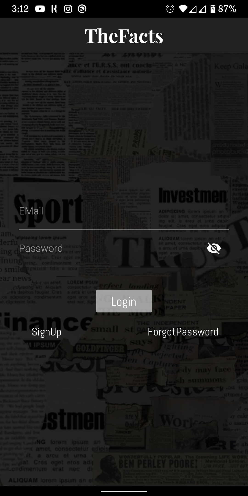
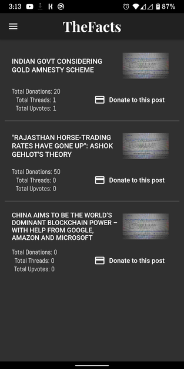
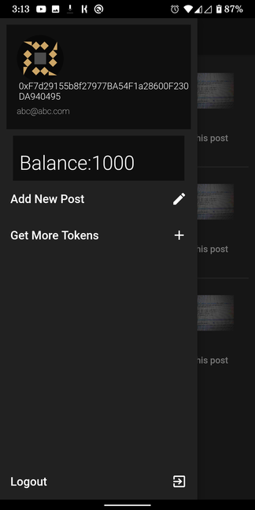
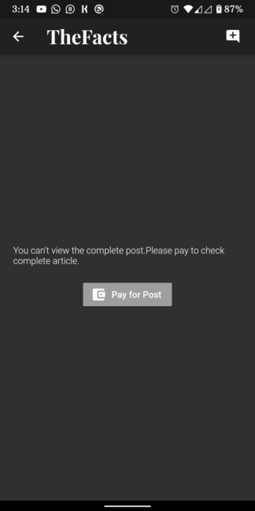
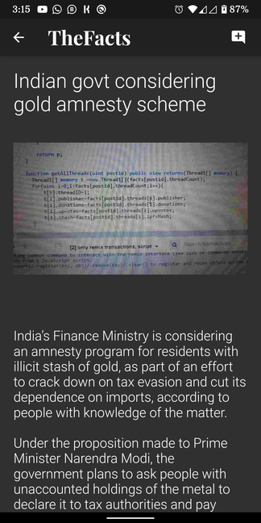
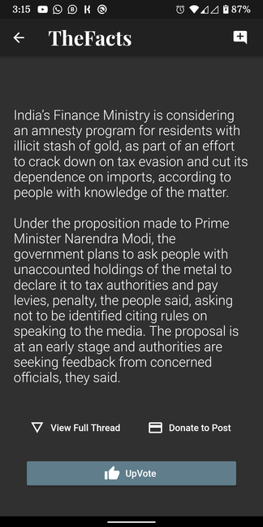
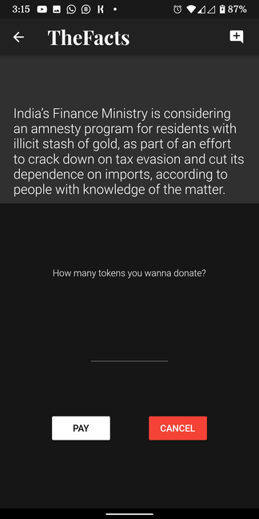
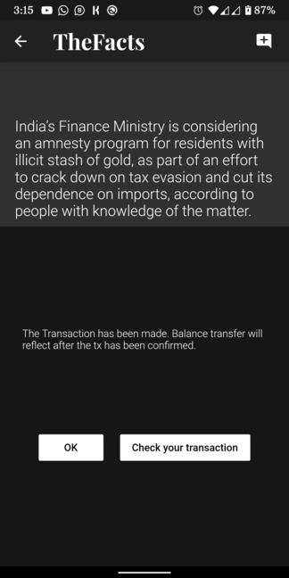
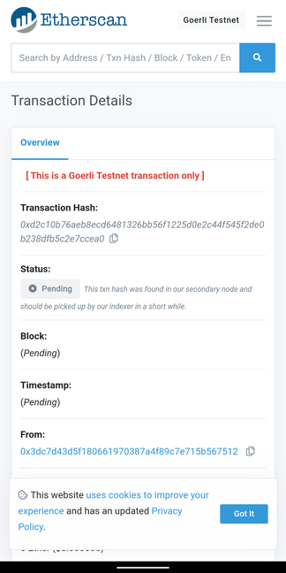
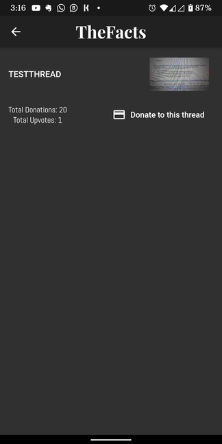

# Facts

### To build it check out respective frontend and backend directory.

### How it works?

#### 1. You need to SignUp and Login using email to use the app. You get 1000 tokens as signup bonus.

#### 2. On Login you are directed to homepage.Drawer on homepage has got your details like balance and your ethereum address on our platform
All the posts are listed on homepage. In latest first fashion. 

* Each Item in list has got summary about the content like title and number of threads, upvotes and total donations to this post.
* Using add new post button you can create a new post and get more toke option is to buy more tokens. 

#### 3. On tapping on one of the posts you are directed to the detailed post. You need to pay 100 tokens to get complete access to the content. 

#### 4. After you've successfully purchased a post. you can view complete content for that post and also read and add threads to that post.Also you can upvote a fact/opinion if you want and also you can donate to the publisher. 
* Add thread button is in appbar

#### 4. When you donate you can check your Tx on etherscan.

#### 5. The full thread can also be viewed after purchasing.

